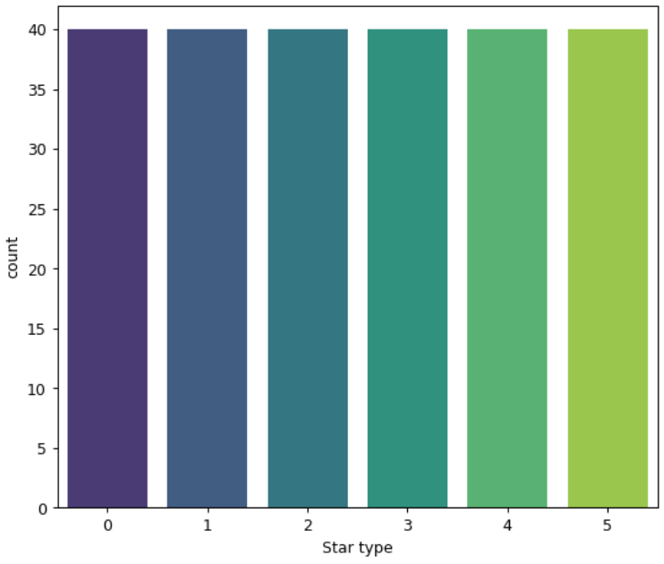
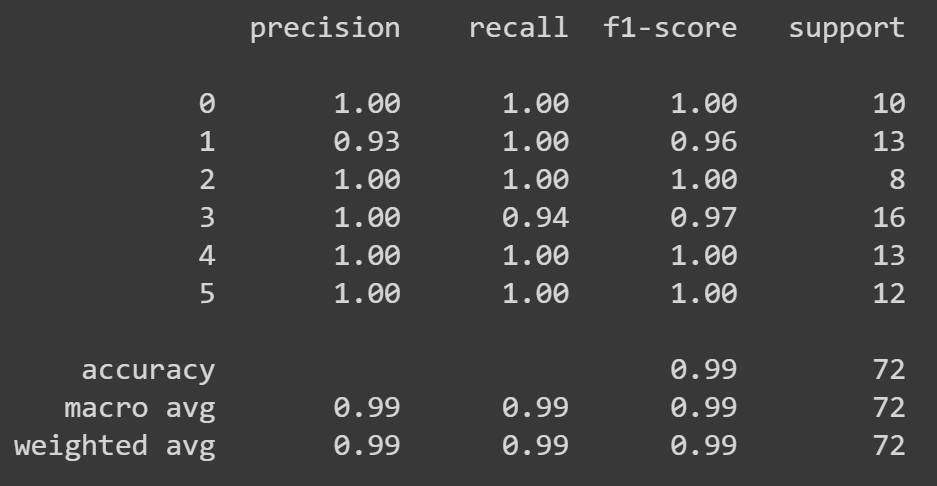
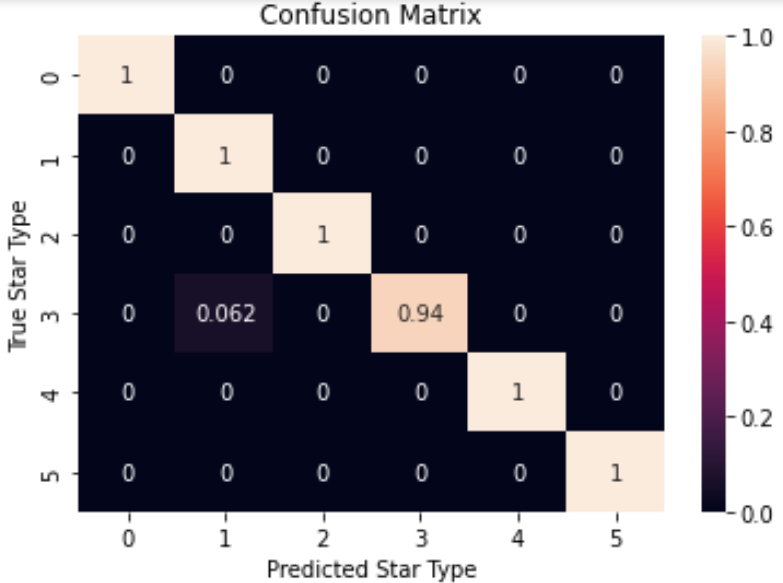

# Final Model Report

## Analytic Approach
* What is target definition

En el modelo desarrollado se fijó una única variable objetivo, a saber la variable relacionada cone el tipo de la estrella. Dicha variable objetivo o de salida, se trata de un valor entero de 0 a 5, que como ya se ha discutido en documentos anteriores tiene como significado:

	* 0. Enana marrón.
	* 1. Enana roja.
	* 2. Enana blanca
	* 3. Secuencia principal.
	* 4. Supergigante.
	* 5. Hipergigante.

* What are inputs (description)

Para realizar una correcta predicción de la variable anteriormente discutida, se tuvo en cuenta la dependencia de la misma en características físicas de la estrella en cuestión. Es por esto que se escogieron las siguientes variables físicas disponibles en el conjunto de datos a estudiar:

	* Temperatura.
	* Luminosidad.
	* Radio.
	* Magnitud Absoluta.

* What kind of model was built?

Para obtener resultados de buena calidad para usarse y realizar posteriores predicciones, así como hacer una rápida implementación y entrenamiento del modelo, se usó un modelo clásico de árbol de desición. Las entradas de dicho modelo fueron las 4 características físicas ya mencionadas, y su salida es un número entero que indica el tipo de la estrella predicha.

## Data
* Source

Los datos usados en este proyecto provienen de la página web de [kaggle](https://www.kaggle.com/datasets/deepu1109/star-dataset) y consisten en un único conjunto en forma de archivo .csv, conformado por 240 filas y 7 columnas, representando 240 estrellas y 7 de sus características principales.

* Data Schema

A continuación se muestran algunos de los datos que se usan en el modelo en un dataframe de Pandas:

* Stats (counts)

Respecto a la distribución de estos datos según la variable objetivo del modelo, que es una variable categórica que toma 6 valores posibles, se hizo un conteo de los datos que se disponían según esta característica como se muestra a continuación:

Mostrando que existe una cantidad balanceada de estrellas de cada tipo para entrenar un modelo que genere predicciones fiables.

## Features
* List of raw and derived features

Las características del archivo original que se usó en el modelo son cada una de las columnas de dicho dataframe y que ya han sido discutidas en otros documentos:

	* Temperatura.
	* Luminosidad.
	* Radio.
	* Magnitud absoluta.
	* Tipo de estrella.
	* Color de la estrella.
	* Clase espectral.

A partir de las anteriores características no fueron extraídas otras más, ya que el modelo a entrenar no lo requería. Aún así, era posible hacer la conversión de las variables tipo texto de la clase espectral y el color de la estrella a variables numéricas para usarse en el modelo usado.

* Importance ranking.

Cada una de las variables mencionadas anteriormente fueron usadas sin dar privilegio o importancia de alguna sobre otra. Mayores detalles se mostrarán más adelante con el esquema del árbol del modelo.

## Algorithm

Como fue mencionado más atrás, se implementó un modelo de aprendizaje automático basado en árboles de decisión, al cual se le realizó una búsqueda de los mejores hiperparámetros para mejorar las predicciones obtenidas sobre un conjunto de validación. Los hiperparámetros trabajados fueron los siguientes:

	* Criterio de partición del árbol.
	* Profundidad del árbol.
  	
Del estudio de los mejores hiperparámetros para el conjunto de datos entrenado se obtuvo que los mejores resultados según el score del modelo en un conjunto de validación era usando el criterio "entropy" para particionar el árbol, y este debía tener una profundidad igual a 5.

A continuación se muestra una imagen del árbol de decisión obtenido con estos hiperparámetros:

## Results

* ROC/Lift charts, AUC, R^2, MAPE as appropriate

Para evaluar y probar la capacidad de predicción del modelo entrenado, se pasó a traves de un `classification report` para conocer su score en diferentes métricas para conjuntos de testeo. Estos fueron los resultados:

Así mismo, estos resultados se vieron gráficamente en una matriz de confusión para ver la capacidad de predicción en cada uno de los tipos de estrella:

